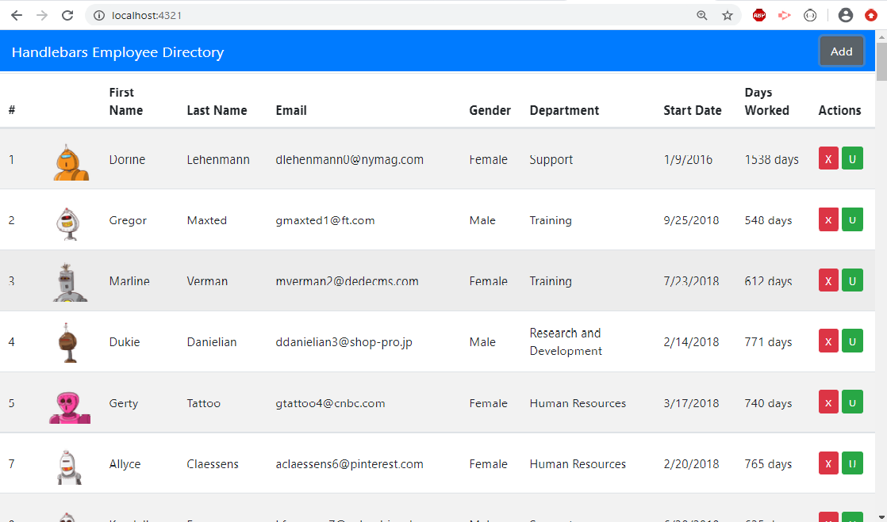

# People Management

  
## Table of contents:
-   [ Description ](#description)
-   [ Installation ](#installation)
-   [ Usage ](#usage)
-   [ License ](#license)

## <a name="description"></a>Description:

'People management' is an application that lets one to view and manage the large amount of people data. Powered by Node js, Handlebars and Mysql. Easy GUI on browser to view and manage.

## <a name="installation"></a>Installation:

```bash
    npm init
    npm i inquirer mysql express express-handlebars
    npm i asciiart-logo ora
```
## <a name="usage"></a>Usage:
Import data to seeds.sql from the given API and set Mysql password in connection followed by: 

```bash
    npm run start 
```


## <a name="contributing"></a>Contributing:
Pull requests are welcome. For major changes, please open an issue first to discuss what you would like to change.Code of Conduct: Standard (Fork, Clone, Commit, Push and Create Pull requests).

## <a name="license"></a>License:
 <i>MIT Copyright (c). All rights reserved.</i>

